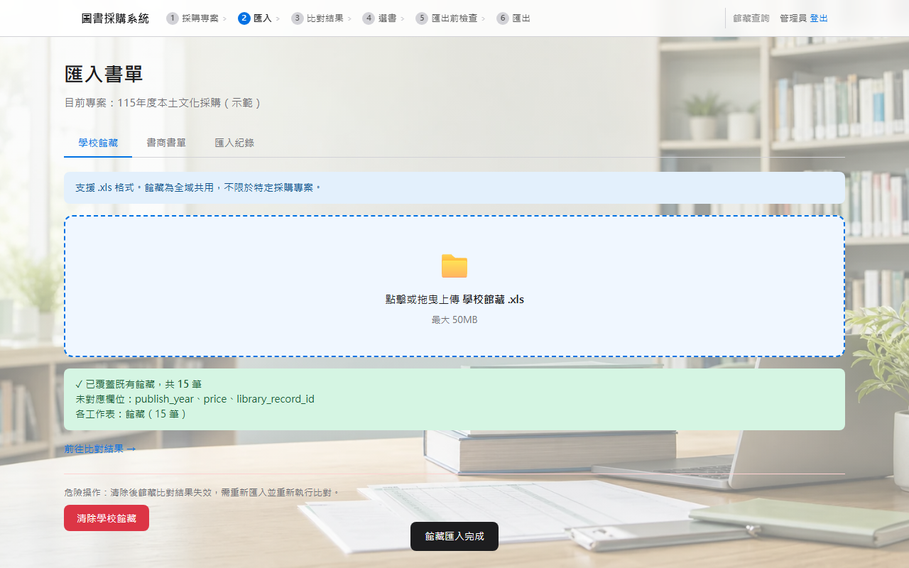
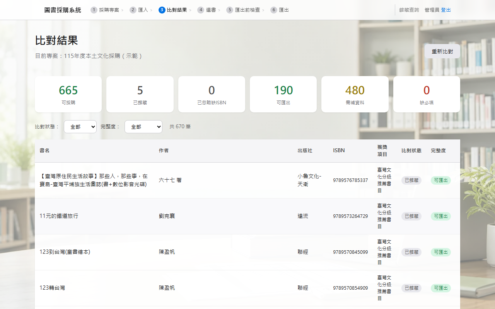
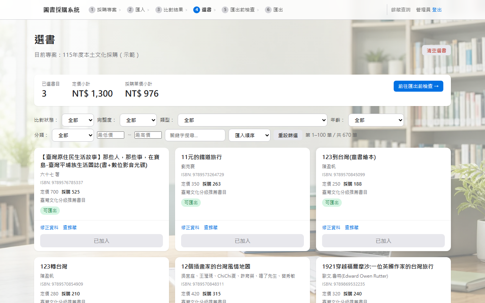
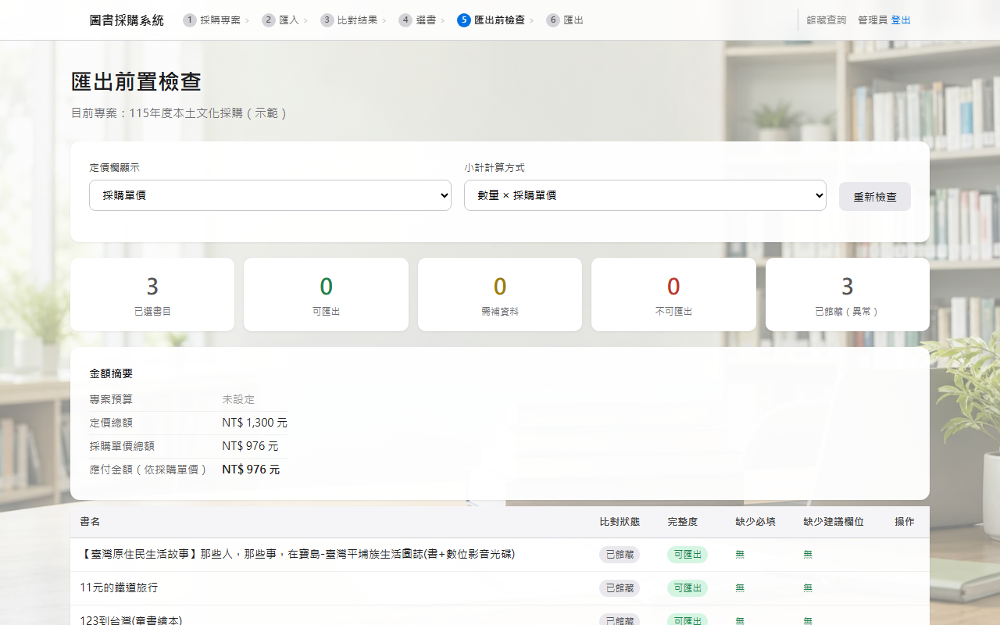

# 完整操作導覽

本文件說明如何使用本系統完成一次完整的圖書採購流程，從登入到匯出採購書單，每個步驟均附操作截圖。

**適用對象：** 國中、國小圖書館管理員、行政人員或負責採購業務的教師。本文件假設您已完成系統安裝與設定。若尚未安裝，請先參閱 [Windows 安裝指南](install-windows.md)。

---

## 目錄

1. [登入系統](#1-登入系統)
2. [採購專案列表](#2-採購專案列表)
3. [建立採購專案](#3-建立採購專案)
4. [匯入館藏](#4-匯入館藏)
5. [匯入書商書單](#5-匯入書商書單)
6. [查看比對結果](#6-查看比對結果)
7. [選書](#7-選書)
8. [匯出前檢查](#8-匯出前檢查)
9. [匯出採購書單](#9-匯出採購書單)
10. [完成與後續](#10-完成與後續)
11. [資料位置與備份](#資料位置與備份)
12. [常見問題](#常見問題)

---

## 使用範例資料測試

本系統提供現成的範例資料，clone 後可直接用於體驗完整流程，無需自備書單或館藏檔案：

| 資料 | 路徑 | 說明 |
|------|------|------|
| 範例館藏 | `sample-data/holdings/sample-holdings.xlsx` | 合成館藏 15 筆（虛構示範資料） |
| 本土文化書商書單 | `sample-data/vendor-lists/local-culture-vendor-list-2026.xlsx` | 約 679 筆推薦書目 |
| 一般圖書書商書單 | `sample-data/vendor-lists/general-books-required-recommended-2026.xlsx` | 約 6,750 筆推薦書目 |

本文件的截圖即使用上述範例資料完成。

---

## 1. 登入系統

確認系統已啟動（已執行 `start.bat` 或手動啟動），瀏覽器開啟 `http://127.0.0.1:8765` 後會顯示登入頁面。

**操作說明：**

1. 在「帳號」欄位輸入管理員帳號（預設為 `admin`）
2. 在「密碼」欄位輸入您在 `config.yaml` 中設定的密碼
3. 點選「登入」按鈕


**預期畫面：** 顯示帳號與密碼欄位，以及「登入」按鈕。

登入成功後會自動跳轉至採購專案列表頁面。

> **注意：** 若出現「帳號或密碼錯誤」，請確認 `config.yaml` 中 `auth.default_admin_password` 的設定值。

---

## 2. 採購專案列表

登入後進入採購專案列表，此頁面是系統的主畫面，顯示所有已建立的採購專案。

首次登入時尚未建立任何專案，頁面顯示空白狀態。


**預期畫面：** 頁面顯示「目前沒有採購專案」或空白清單，以及「新增專案」按鈕。

---

## 3. 建立採購專案

每次採購需建立一個對應的採購專案，用來區分不同年度或不同類型的採購作業。

**操作說明：**

1. 在採購專案列表頁面，點選「新增專案」按鈕
2. 在「專案名稱」欄位填入本次採購的名稱（例如：`115年度本土文化採購`）
3. 在「採購類型」下拉選單中選擇對應類型：
   - **本土文化採購**：使用本土文化圖書書單
   - **一般圖書採購**：使用一般圖書推薦書單
4. 點選「建立」按鈕


**預期畫面：** 顯示新增專案表單，專案名稱欄已填寫，類型已選擇。

專案建立後，點選「選擇」即可進入該專案，開始後續的匯入與選書作業。

> **注意：** 採購類型一旦建立後無法更改，請確認選擇正確。不同類型的書商書單欄位格式略有差異。

---

## 4. 匯入館藏

館藏資料用於與書商書單比對，讓系統判斷哪些書目學校已有館藏，避免重複採購。

**操作說明：**

1. 在導覽列點選「匯入」
2. 確認頁面顯示「館藏」分頁（預設即為館藏分頁）
3. 點選上傳區域或將館藏 Excel 拖曳至上傳區
   - 若使用範例資料，選擇 `sample-data/holdings/sample-holdings.xlsx`
4. 系統自動偵測欄位對應（書名、ISBN、作者、出版社等）
5. 確認欄位對應無誤後，點選「確認匯入」



**預期畫面：** 顯示匯入成功訊息，包含匯入的書目筆數。使用範例館藏時應顯示「共 15 筆」。

> **注意：** 館藏資料可重複匯入，每次匯入會以新資料覆蓋既有記錄。若館藏有更新，直接重新上傳最新的 Excel 即可。

---

## 5. 匯入書商書單

書商書單是書商提供的推薦採購書目清單，系統會將書單與館藏資料比對，標示哪些書目尚未館藏。

**操作說明：**

1. 在「匯入」頁面，點選「書商書單」分頁
2. 確認右上角顯示目前所選的採購專案名稱
3. 點選上傳區域或將書商書單 Excel 拖曳至上傳區
   - 若使用範例資料，選擇 `sample-data/vendor-lists/local-culture-vendor-list-2026.xlsx`
4. 系統顯示欄位對應預覽，確認書名、ISBN、作者、出版社、定價等欄位正確對應
5. 確認欄位對應後，點選「下一步」
6. 依序完成欄位確認（共數個步驟），最後點選「確認匯入」


**預期畫面：** 顯示匯入成功訊息與匯入筆數。使用本土文化範例書單時應顯示約 679 筆。

> **注意：** 若書商書單分為多份，可依相同步驟逐份匯入；系統會合併書目。

---

## 6. 查看比對結果

館藏與書商書單均匯入後，系統會自動完成比對，可在「比對結果」頁面查看結果。

**操作說明：**

1. 在導覽列點選「比對結果」
2. 頁面頂部顯示統計摘要（書商書單總筆數、已館藏數量、未館藏數量）
3. 下方表格顯示所有書目，以及各書目的比對狀態：
   - **未館藏**：學校目前無此書，可納入採購考慮
   - **已館藏**：館藏已有此書，採購前請再次確認
4. 可使用篩選按鈕或搜尋欄位縮小顯示範圍



**預期畫面：** 頁面上方顯示統計卡片（總數、已館藏、未館藏），下方顯示書目清單。使用範例資料時，應有 5 筆「已館藏」（來自範例館藏中對應的 ISBN）。

> **注意：** 比對以 ISBN 為主要依據。若書目的 ISBN 欄位為空，系統仍會顯示此書目，但無法自動比對，請人工確認。

---

## 7. 選書

確認比對結果後，從書目清單中挑選要採購的書目，並填寫必要的欄位資訊。

**操作說明：**

1. 在導覽列點選「選書」
2. 頁面顯示書商書單中的書目卡片
3. 在想要採購的書目上，點選「加入選書」按鈕
4. 已加入選書的書目，欄位會展開，可填寫：
   - **A 欄（資格標記）**：依採購規範選擇，例如「必選書」或「推薦書」
   - **H 欄（推薦來源）**：填入推薦依據
   - 其他補充欄位（若書商書單缺漏，可在此補填定價等資訊）
5. 欄位填寫後系統自動儲存，不需手動按「儲存」



**預期畫面：** 顯示書目卡片清單，已加入選書的書目呈現不同樣式（按鈕變為灰色或顯示「已選」），並可展開查看欄位。

> **資料完整度提示：**
> - **可匯出**：必填欄位均已填寫
> - **需補充**：部分欄位缺漏，建議補齊（仍可匯出，但書單可能不完整）
> - **缺必填**：定價或書名缺漏，請於匯出前補齊

---

## 8. 匯出前檢查

選書完成後，建議先至「匯出前檢查」頁面確認所有書目的資料完整度，避免匯出後才發現缺漏。

**操作說明：**

1. 在導覽列點選「匯出前檢查」
2. 頁面顯示所有已選書目，並標示各書目的完整度狀態
3. 對資料不完整的書目，可直接在此頁面點選編輯，補填缺漏欄位
4. 若確認某書目不需要採購，可點選「移除」將其從本次採購清單中刪除
5. 確認所有書目狀態符合需求後，繼續下一步



**預期畫面：** 顯示已選書目清單，每筆書目旁有完整度標示（可匯出 / 需補充 / 缺必填），頁面頂部有統計摘要。

---

## 9. 匯出採購書單

確認書目資料完整後，匯出正式的採購書單 Excel 檔案。

**操作說明：**

1. 在導覽列點選「匯出」
2. 確認「匯出範本」欄位已自動選擇對應的範本（依採購專案類型決定）
3. 在「學校名稱」欄位填入您的學校全名
4. 點選「產生採購書單」按鈕
5. 系統產生 Excel 檔案，瀏覽器會自動下載


**預期畫面：** 顯示匯出設定頁面，包含範本選擇、學校名稱填寫欄位，以及「產生採購書單」按鈕。

> **注意：**
> - 若年度採購書單格式有異動，請先至導覽列「**範本管理**」更新空白範本，再回此頁重新匯出。詳見 [匯出範本管理](export-template-management.md)。
> - 學校名稱將出現在匯出書單的表頭，請確認填寫正確。
> - 匯出檔案儲存於 `./exports/` 資料夾，不會自動刪除，請定期清理。

---

## 10. 完成與後續

匯出完成後，回到採購專案列表，可看到專案卡片上顯示最新的採購狀態（已匯出書目數量等）。


**預期畫面：** 採購專案卡片顯示最新狀態，包含書目數量與最近匯出記錄。

**後續步驟：**

1. 開啟 `./exports/` 資料夾，找到剛才產生的 Excel 採購書單
2. 以 Excel 開啟，確認表頭學校名稱、書目列表、欄位數值均正確
3. 確認無誤後，依學校採購作業流程提交書單

> 若發現書單有誤，可回到[步驟 7（選書）](#7-選書)或[步驟 8（匯出前檢查）](#8-匯出前檢查)修正後重新匯出。

---

## 資料位置與備份

系統所有資料均存放於本機，以下路徑均已加入 `.gitignore`，不會上傳至任何雲端或版本控制：

| 路徑 | 說明 |
|------|------|
| `./data/school_lib.db` | 主要資料庫（館藏、書商書單、選書記錄） |
| `./exports/` | 匯出的採購書單 Excel |
| `./00_source/` | 書商提供的原始 Excel 書單（若有放置） |
| `./config.yaml` | 系統設定（含密碼，請妥善保管） |

**建議定期備份：**

將以下路徑複製至外部硬碟或其他安全位置：

```
data\school_lib.db
exports\
config.yaml
```

`data\school_lib.db` 包含所有館藏記錄、書商書單與選書資料，是最重要的備份目標。

---

## 常見問題

### 登入後看不到之前的資料

系統資料儲存於 `data\school_lib.db`。若更換電腦或重新安裝，需將備份的資料庫檔案複製回 `data\` 資料夾。

### 書目未出現於比對結果

- 確認書商書單已成功匯入（匯入頁面顯示成功筆數）
- 確認目前選取的採購專案與匯入書單時相同（頁面右上角應顯示目前專案名稱）
- 確認欄位對應正確（書名、ISBN 等關鍵欄位有對應到）

### 已館藏書目數量為 0

- 確認館藏 Excel 已成功匯入
- 確認館藏 Excel 中有 ISBN 欄位且有值
- 書商書單與館藏的 ISBN 格式需一致（例如有無連字號）

### 選書後欄位值未儲存

- 欄位填寫後，點選欄位外的空白處或按 Tab 鍵確認儲存
- A 欄（資格標記）與 H 欄（推薦來源）請從下拉選單選擇，直接輸入文字可能無法生效
- 確認瀏覽器未封鎖與本機伺服器的連線

### 匯出時顯示「找不到範本」或格式異常

- 至導覽列「**範本管理**」確認對應類型的範本已正確上傳並存入，詳見 [匯出範本管理](export-template-management.md)
- 確認存入時有顯示「範本已更新，立即生效」的成功提示
- 若範本存在但格式仍異常，可重新上傳範本並重新確認欄位偵測結果

### 重新匯入書商書單後，選書記錄消失

重新匯入書商書單會以新資料覆蓋，若書目 ISBN 不變，選書記錄通常可保留。建議在重新匯入前先匯出一份採購書單備存。

### 需要使用其他縣市或年度的採購書單範本

至導覽列「**範本管理**」，選擇對應採購類型，上傳新的空白 Excel 範本後存入，後續匯出即會採用新格式。詳細操作步驟請參閱 [匯出範本管理](export-template-management.md)。
